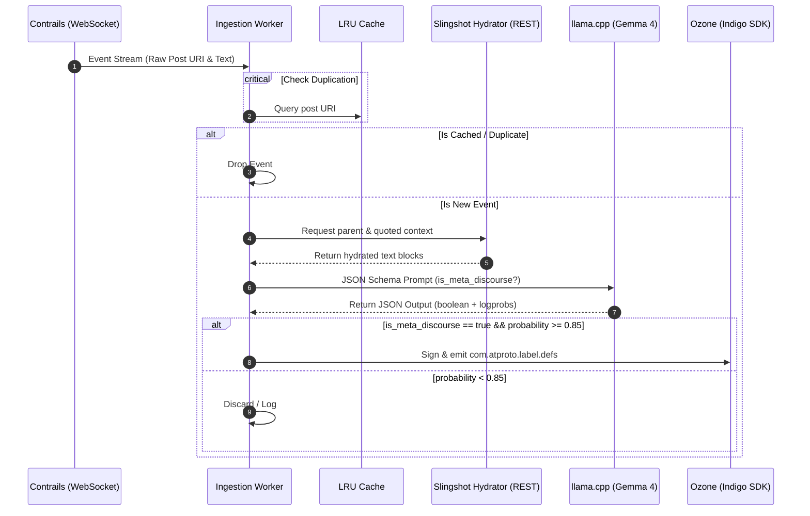

# Bluesky Meta-Discourse Labeler 🏷️🤖

The **Bluesky Meta-Discourse Labeler** is a high-performance Go-based background daemon designed to classify real-time posts from the Bluesky feed for "meta-discourse" and cryptographically sign and emit labels to an Ozone moderation instance.

The system leverages a hybrid cloud-and-edge architecture, using Go to orchestrate firehose ingestion from [Graze Contrails](https://graze.social) and post context hydration via [Microcosm Slingshot](https://constellation.microcosm.blue). Hydrated posts are then classified locally using Gemma 4 via `llama.cpp`, with positive matches cryptographically signed using the ATProto Indigo library and emitted to an Ozone moderation server.

## Conceptual Definition: Meta-Discourse

### What is Meta-Discourse? (TRUE)
Posts evaluating, criticizing, or theorizing about the cultural and social experience of Bluesky itself. This includes:
- Debating the platform's "vibes," echo chambers, or user base behaviors.
- Comparing the social experience, engagement dynamics, or toxicity of Bluesky versus X (Twitter) or other platforms.
- Complaining about the types of conversations people have (e.g., "dead-end conversations", "too much drama", "people subtweeting").
- Subtweets or reactions regarding Bluesky's community culture.

### What is NOT Meta-Discourse? (FALSE)
- Technical discussions about building on ATProto, creating feeds, using APIs, or hosting infrastructure.
- Announcements or discussions of new Bluesky application features (e.g., "DMs are live").
- General political, social, or pop culture arguments (even if heated or referencing platform moderation), as long as they do not explicitly analyze platform culture.
- Passing usage of platform terms like "skeet" or "repost".

## Quick Start

Get the entire stack up and running locally:

### 1. Set Up Ozone
You will need a running Ozone instance to receive moderation labels. If you don't have one set up, follow the official [Ozone Hosting Guide](https://github.com/bluesky-social/ozone/blob/main/HOSTING.md) first.

### 2. Configure Environment Variables
Copy the example environment file and fill in your keys:
```bash
cp .env.example .env
```
At a minimum, configure the following variables in `.env`:
- `GRAZE_FEED_URI` (The AT-URI of the feed to listen to)
- `LABELER_DID` (Your cryptographic labeler DID)
- `OZONE_ENDPOINT` (URL of your Ozone server)
- `OZONE_ADMIN_TOKEN` (Your Ozone admin/auth token)

### 3. Run the Stack
Both the Go daemon and the local `llama.cpp` inference server are containerized. Build and launch the entire stack using Docker Compose:
```bash
docker compose up --build -d
```

> 💡 **Tip for Developers:** If you are modifying the Go daemon locally and want hot-reloading/direct logs, run only the model inference server in Docker and run the Go daemon natively:
> ```bash
> # Start only the local LLM
> docker compose up -d llama-server
> 
> # Run the Go daemon locally
> make run
> ```


## Configuration Reference

The daemon is configured entirely through environment variables or a `.env` file at the root.

| Variable | Default | Description |
|---|---|---|
| `PORT` | `8081` | Port to run the status/health server on. |
| `LOG_LEVEL` | `info` | Logging verbosity (`debug`, `info`, `warn`, `error`). |
| `CURSOR_FILE_PATH` | `./data/cursor.json` | Path to store the firehose replication cursor state. |
| `CURSOR_REWIND_SECONDS`| `10` | Number of seconds to rewind firehose state upon reconnection. |
| `HYDRATION_WORKERS` | `10` | Concurrent worker count for fetching parent/quoted post context. |
| `CLASSIFICATION_WORKERS`| `4` | Concurrent worker count for running local LLM inference. |
| `GRAZE_FEED_URI` | *Required* | The AT-URI of the Bluesky feed to ingest events from. |
| `CONTRAILS_WS_URL` | `wss://api.graze.social/app/contrail` | Graze Contrails event WebSocket endpoint. |
| `SLINGSHOT_URL` | `https://slingshot.microcosm.blue` | Microcosm Slingshot edge cache RPC endpoint. |
| `LLM_ENDPOINT` | `http://localhost:8080/v1/` | Base URL of OpenAI-compatible inference server. |
| `LLM_MODEL` | `google/gemma-4-e2b-gguf` | LLM model identifier. |
| `LLM_TEMPERATURE` | `0.0` | Sampling temperature for classification (keep at `0.0` for determinism). |
| `OZONE_ENDPOINT` | `http://localhost:3000` | Target Ozone moderation server API endpoint. |
| `LABELER_DID` | *Required* | Cryptographic DID of the network labeler service. |
| `OZONE_ADMIN_TOKEN` | *Required* | Authentication token for Ozone server write-access. |
| `DRY_RUN` | `false` | If `true`, classifications are computed but labels are not sent to Ozone. |
| `LLM_SYSTEM_PROMPT` | *(Empty)* | Raw system prompt override string. |
| `LLM_SYSTEM_PROMPT_PATH`| *(Empty)* | File path to load custom system prompt from. |

## System Architecture & Data Flow

The labeler is built for low-latency firehose filtering and processing using a multi-worker async pipeline:



### Component Directory Map

- **Config Loader (`internal/config/`)**: Decodes and validates environment variables and custom runtime system prompt overrides.
- **Pipeline Coordinator (`internal/pipeline/`)**: Directs multi-worker async flow, caching, cursor state persistence, and event processing.
- **Services Package (`internal/services/`)**:
  - `contrails.go`: Subscribes to filtered firehose WebSocket stream.
  - `slingshot.go`: Hydrates parent & quote context from Edge RPC cache.
  - `classifier.go`: Encodes posts into custom XML schemas and executes inference against `llama.cpp`.
  - `ozone.go`: Signs and broadcasts cryptographic labels.

## Development & Contribution

### Prerequisites
- Go 1.21+
- Docker & Docker Compose

### Tooling & Make Commands

We package development utilities inside the `Makefile`:

```bash
# Build the labeler binary
make build

# Run all unit tests
make test

# Run the daemon locally
make run

# Verify agent-readiness and harness rules
make verify-harness
```

### Collaboration Guidelines (Git-Flow)
We adhere strictly to the **Git-Flow** branching model. Do not commit directly to primary branches.
1. Always synchronize your branch from the upstream `develop` branch.
2. Create a dedicated feature branch:
   ```bash
   git checkout develop
   git pull origin develop
   git checkout -b feature/your-feature-name
   ```
3. Commit with structured Conventional Commit format (e.g. `feat: ...`, `fix: ...`).
4. Ensure your branch passes the automated harness validation before opening a PR:
   ```bash
   make verify-harness
   ```
5. Target all Pull Requests to the `develop` integration branch.

For comprehensive agent compliance and repository structural rules, see [AGENTS.md](AGENTS.md).


