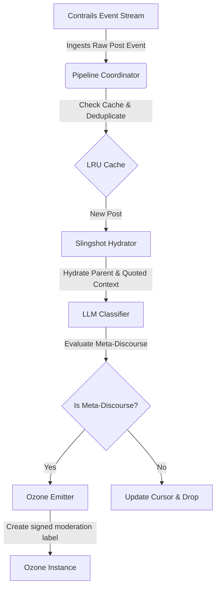

# Architecture

<!-- Keep this document current. It's referenced from AGENTS.md and read by agents
     when they need to understand the system before making changes. -->

## System Overview

The **Bluesky Meta-Discourse Labeler** is a high-performance Go-based background daemon designed to ingest real-time Bluesky feed events from a Contrails event stream, hydrate events with contextual parent and quoted metadata, classify posts for meta-discourse utilizing a local or remote Large Language Model (LLM), and emit classification labels to an instance of Ozone (the Bluesky moderation and labeling server).

## Component Map

| Component | Responsibility | Key Files |
|---|---|---|
| **Config Loader** | Parses and validates environment variables and custom runtime system prompt overrides. | [config.go](file:///home/nmanos/Documents/Code/discourse-labeler/internal/config/config.go) |
| **Pipeline Coordinator** | Orchestrates asynchronous multi-worker event hydration, classification, and label emission. | [coordinator.go](file:///home/nmanos/Documents/Code/discourse-labeler/internal/pipeline/coordinator.go) |
| **LLM Classifier** | Formats context-hydrated posts as XML and interacts with OpenAI-compatible GGUF/LLM runtimes. | [classifier.go](file:///home/nmanos/Documents/Code/discourse-labeler/internal/services/classifier.go) |
| **Contrails Ingester** | Establishes WebSocket subscription to the feed's firehose. | [contrails.go](file:///home/nmanos/Documents/Code/discourse-labeler/internal/services/contrails.go) |
| **Slingshot Hydrator** | Hydrates raw posts with parent/quoted contents via REST endpoints. | [slingshot.go](file:///home/nmanos/Documents/Code/discourse-labeler/internal/services/slingshot.go) |
| **Ozone Emitter** | Queries existing post labels and emits newly generated labels. | [ozone.go](file:///home/nmanos/Documents/Code/discourse-labeler/internal/services/ozone.go) |

## Dependency Rules

<!-- Define what can import/depend on what. This prevents architectural drift. -->

- `internal/config/` MUST NOT depend on `internal/services/` or `internal/pipeline/`.
- `internal/pipeline/` (Coordinator, LRUCache) depends only on raw domain models and config parameters. It communicates with services via interfaces.
- `internal/services/` (Adapters/Attached resources) depends on raw interface definitions inside the pipeline package.
- `cmd/labeler/` may depend on any `internal/` package for lifecycle bootstrap.

## Data Flow

## Key Decisions

| Decision | Rationale | Date |
|---|---|---|
| **Go Concurrency & Channels** | Ensures real-time event firehose throughput with lightweight goroutines. | 2026-05-24 |
| **XML Schema Formatting** | Delimiting target, parent, and quoted messages inside `<posts>` structures guarantees context boundary tracking. | 2026-05-25 |
| **Functional Option Override** | Using functional options in Go prevents initialization mutations and permits testing prompt overrides locally. | 2026-05-25 |
