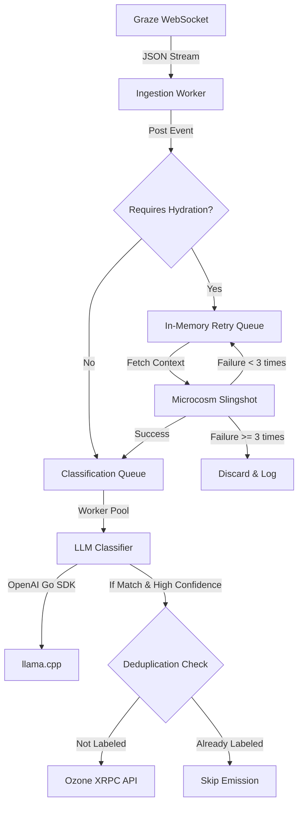

# Bluesky Meta-Discourse Labeler: Technical Design Specification

* **Date:** 2026-05-24
* **Author:** Antigravity AI Coding Assistant
* **Status:** Proposed

---

## 1. Project Overview

This specification defines the system architecture and implementation details for the **Bluesky Meta-Discourse Labeler**. The system is designed to stream filtered social media events from the Bluesky network, classify them in real-time to identify "Bluesky Meta-Discourse" (criticism or theorizing regarding the platform's social culture, user behaviors, and platform dynamics), and emit stackable labels to a self-hosted or remote Bluesky Ozone moderation system.

To minimize compute constraints, the application adopts a high-efficiency cloud-and-edge hybrid approach:
1. **Ingestion (Graze Contrails):** Streams only the network events that match our search queries over a WebSocket.
2. **Context Hydration (Microcosm Slingshot):** Synchronously resolves parent/quoted post text to provide deep conversation context.
3. **Local Inference (llama.cpp):** Runs local, quantized `gemma-4-e2b` inference using a strict JSON schema and logprob confidence analysis.
4. **Decoupled Moderation (Ozone):** Emits labels to an Ozone moderation instance via standard, authenticated XRPC APIs.

---

## 2. System Architecture & Component Design

The application runs as a modular, concurrent Go daemon. The pipeline uses Go channels and worker pools to isolate network I/O from compute-intensive LLM classification.



### 2.1. Core Pipeline Stages

* **Ingestion Worker:** Established using `gorilla/websocket`. Connects to `wss://api.graze.social/app/contrail?feed={FEED_URI}&cursor={CURSOR}`. Parses standard Bluesky Jetstream format JSON envelopes, extracting the text, reply parameters, and embedded records.
* **Context Hydrator:** A pool of concurrent goroutines making HTTP GET requests to Microcosm Slingshot (`com.atproto.repo.getRecord`). Parses AT-URIs to resolve parent/quoted post content.
  * *Failure Recovery:* Uses a scheduler (`time.AfterFunc`) to retry failed hydration queries up to 3 times with exponential backoff (500ms, 1s, 2s) before discarding.
* **LLM Classifier:** Employs `github.com/openai/openai-go` pointing to the local `llama-server`. Sends hydrated posts utilizing a strict GBNF JSON schema structure.
* **Label Emitter:** Performs authenticated HTTP POST calls to Ozone's `/xrpc/tools.ozone.moderation.emitEvent` to tag posts in the live network.

---

## 3. High-Performance Deduplication & Recovery

To prevent redundant LLM classification and double-label emissions during a stream recovery rewind, the application implements a hybrid **two-layer deduplication** strategy:

1. **Layer 1: In-Memory LRU Cache (Fast Skip):**
   * Maintains a thread-safe LRU cache containing the last 5,000 processed post AT-URIs.
   * If a post is present in the cache, it is immediately skipped with zero network/CPU overhead.
2. **Layer 2: Public XRPC Query (Source of Truth):**
   * If a post is classified as positive by the LLM, the daemon makes a quick public XRPC GET request to `/xrpc/com.atproto.label.queryLabels?uriPatterns={POST_URI}&sources={LABELER_DID}` before emitting the label.
   * If the post has already been labeled by our labeler DID, the event emission is skipped. Since this lookup is only performed for positive matches, it will not impact pipeline throughput.

### 3.1. Atomic Cursor Persistence

To guarantee zero-data-loss recovery across system restarts:
* The Jetstream sequence cursor (`time_us`) is written atomically to disk using a write-sync-rename cycle (`cursor.tmp` -> `cursor.json`).
* Cursor flushes are throttled to run:
  * At least once every **1 second**, OR
  * Every **100 processed posts**, OR
  * **Immediately** upon successfully emitting a positive label to Ozone.
* Upon startup, the recovery system reads `cursor.json`, deliberately **rewinds the cursor by 10 seconds** (configurable), and appends it to the Contrails WebSocket connection.

---

## 4. Directory Layout

The project structure enforces strict separation of concerns, isolating the core business rules from transport frameworks.

```text
discourse-labeler/
├── cmd/
│   └── labeler/
│       └── main.go         # Application entry point, signal handling, and recovery
├── internal/
│   ├── config/
│   │   └── config.go       # Environment variables parsing and validation
│   ├── pipeline/
│   │   ├── coordinator.go  # Go channel routing and lifecycle coordinator
│   │   ├── cursor.go       # Atomic cursor file persistence
│   │   └── types.go        # Common Go models for Jetstream, Slingshot, and Llama
│   ├── services/
│   │   ├── contrails.go    # Gorilla WebSocket ingestion client
│   │   ├── slingshot.go    # Context hydration HTTP client
│   │   ├── classifier.go   # Local llama.cpp client (OpenAI Go SDK)
│   │   └── ozone.go        # Authenticated Ozone emitEvent XRPC client
│   └── mock/
│       └── mock_services.go# Dry-run logging adapters
├── docs/
│   ├── DRAFT-SPEC.md
│   └── superpowers/
│       └── specs/
│           └── 2026-05-24-discourse-labeler-design.md # This specification
├── Dockerfile              # Multi-stage, non-root Google Distroless builder
├── docker-compose.yml       # Lean CPU & GPU-toggle dev stack (llama-server + daemon)
├── go.mod
└── go.sum
```

---

## 5. Core Technical Specifications

### 5.1. Common Interfaces (`internal/pipeline/coordinator.go`)

```go
package pipeline

import (
	"context"
	"github.com/npmanos/discourse-labeler/internal/pipeline/types"
)

// Ingester handles streaming raw events from Contrails
type Ingester interface {
	Start(ctx context.Context, cursor int64, out chan<- *types.RawEvent) error
}

// Hydrator resolves post context (parent/quoted post) from Slingshot
type Hydrator interface {
	Hydrate(ctx context.Context, post *types.RawEvent) (*types.HydratedPost, error)
}

// Classifier communicates with Llama.cpp to evaluate discourse
type Classifier interface {
	Classify(ctx context.Context, post *types.HydratedPost) (*types.ClassificationResult, error)
}

// LabelEmitter pushes positive results to our Ozone service
type LabelEmitter interface {
	EmitLabel(ctx context.Context, result *types.ClassificationResult) error
}
```

### 5.2. Multi-Stage Distroless `Dockerfile`

Compiles the Go daemon using `golang:1.22-alpine` and packages it inside Google Container Tools' ultra-minimal and hardened **Debian 13 Distroless static image**, executing under the unprivileged `nonroot` user profile.

```dockerfile
# --- Stage 1: Build statically linked Go binary ---
FROM golang:1.22-alpine AS builder
WORKDIR /src
RUN apk add --no-cache git ca-certificates
COPY go.mod go.sum ./
RUN go mod download
COPY . .
RUN CGO_ENABLED=0 GOOS=linux GOARCH=amd64 \
    go build -ldflags="-w -s" -o /bin/labeler ./cmd/labeler/main.go

# --- Stage 2: Hardened Debian 13 Distroless Runtime ---
FROM gcr.io/distroless/static-debian13:nonroot
WORKDIR /app
COPY --from=builder /bin/labeler /app/labeler
USER 65532:65532
ENTRYPOINT ["/app/labeler"]
```

### 5.3. Lean `docker-compose.yml`

A clean local developer environment comprising our statically compiled daemon and the local `llama.cpp` container, supporting hardware acceleration toggles.

```yaml
version: '3.8'

services:
  # 1. The Go Classification Daemon
  labeler-daemon:
    container_name: labeler_daemon
    build:
      context: .
      dockerfile: Dockerfile
    restart: unless-stopped
    depends_on:
      - llama-server
    env_file:
      - .env
    volumes:
      - ./data:/app/data

  # 2. Local LLM Classification Engine (llama.cpp)
  llama-server:
    container_name: discourse_llm
    # --- CPU VERSION (Default) ---
    image: ghcr.io/ggml-org/llama.cpp:server
    # --- GPU VERSION (Optional: Uncomment to use Nvidia GPU) ---
    # image: ghcr.io/ggml-org/llama.cpp:server-cuda
    # deploy:
    #   resources:
    #     reservations:
    #       devices:
    #         - driver: nvidia
    #           count: all
    #           capabilities: [gpu]
    restart: unless-stopped
    ports:
      - "8080:8080"
    volumes:
      - ./models:/models
    command: >
      -m /models/gemma-4-e2b.gguf
      --host 0.0.0.0
      --port 8080
      -c 8192
      --hf-repo "google/gemma-4-e2b-gguf"
      --hf-file "gemma-4-e2b.Q4_K_M.gguf"
      # --n-gpu-layers 99  # (Optional: Uncomment for GPU acceleration)
```

---

## 6. Local Testing & Mocking (Dry Run)

To guarantee an outstanding local developer loop, the system implements a `DRY_RUN` profile. When `DRY_RUN=true` is set in the environment:
1. The application starts up with **zero external dependencies** outside the LLM.
2. It streams posts and classifies them in real-time.
3. If a post classifies as positive, it **skips the Ozone XRPC POST request** and prints a beautifully formatted summary of the positive classification, parent context, and probability statistics directly to `stdout`.
4. This ensures that any engineer can run the system and test the classification model in seconds without possessing actual ATProto private keys, DIDs, or hosting infrastructures.
